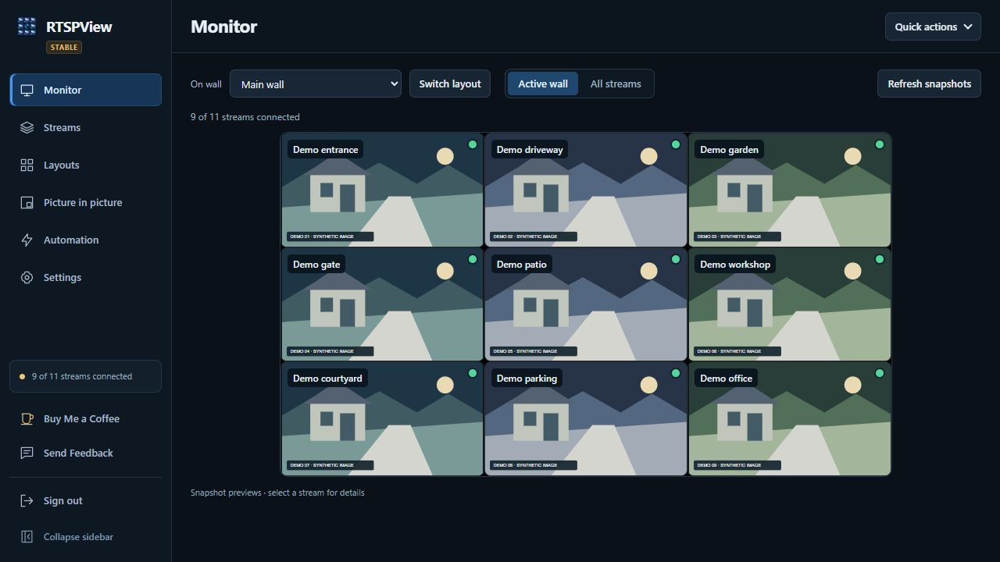
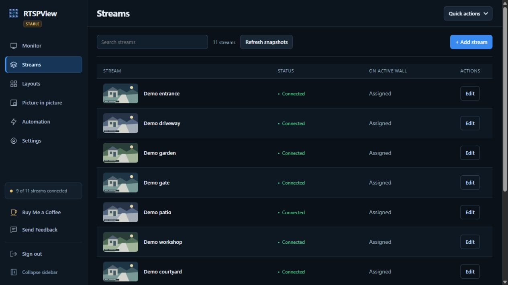
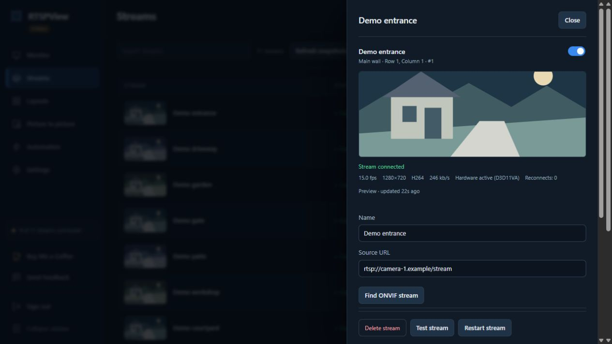
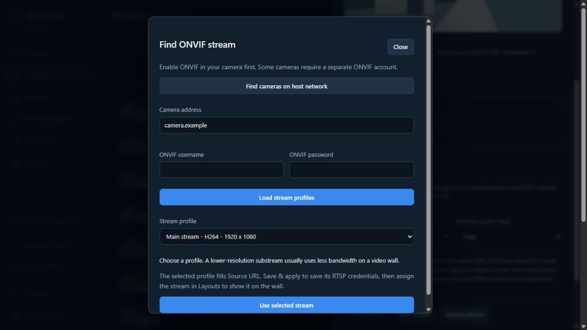
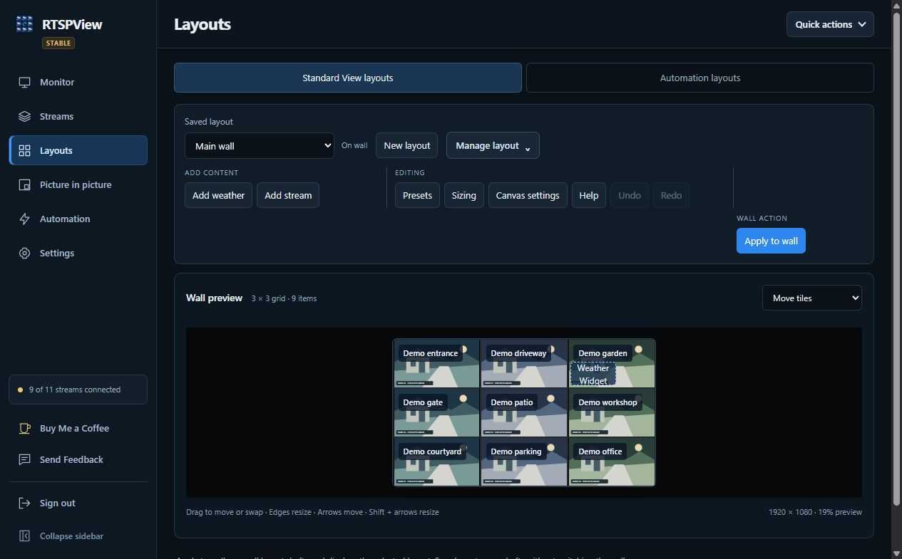
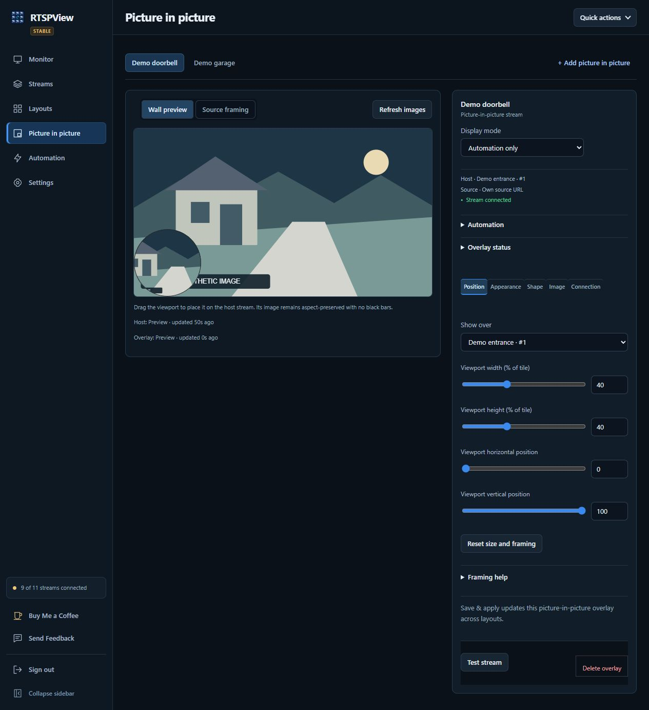
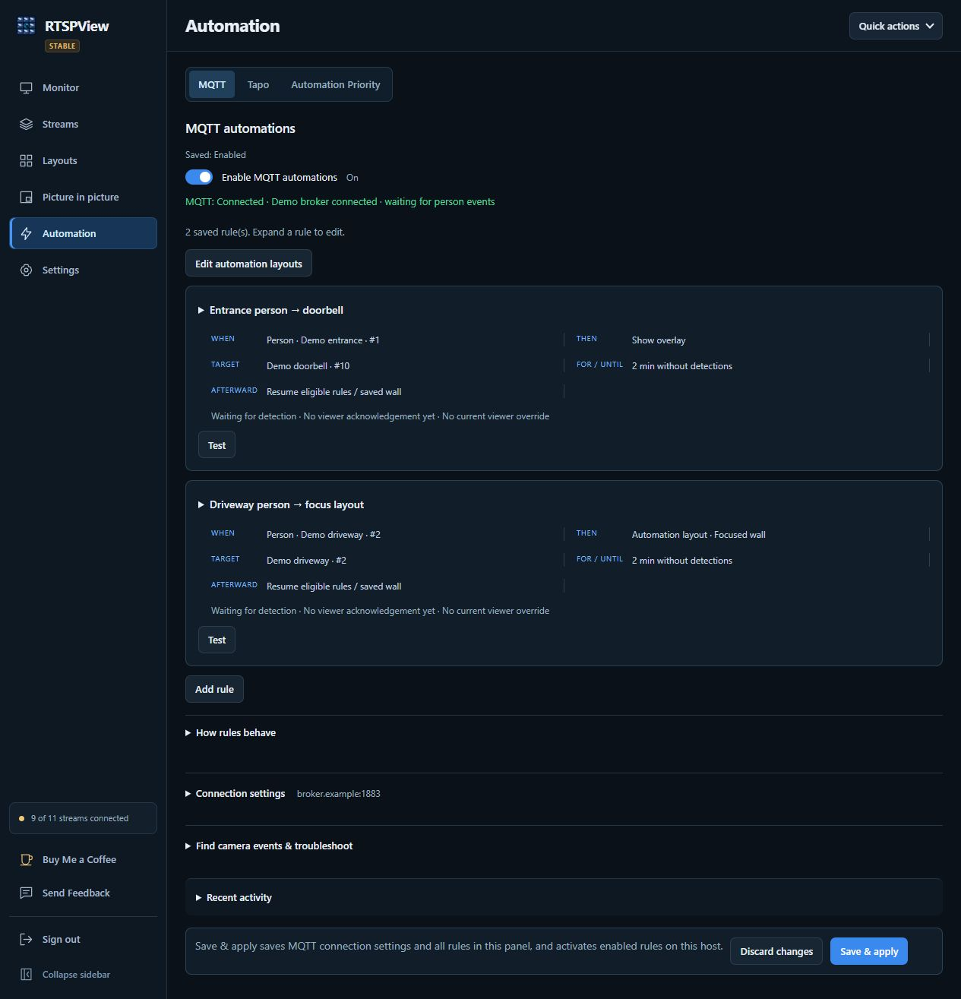
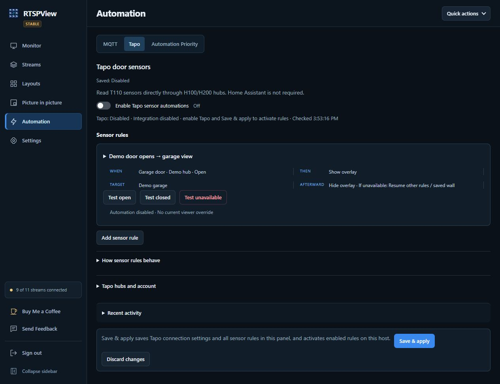
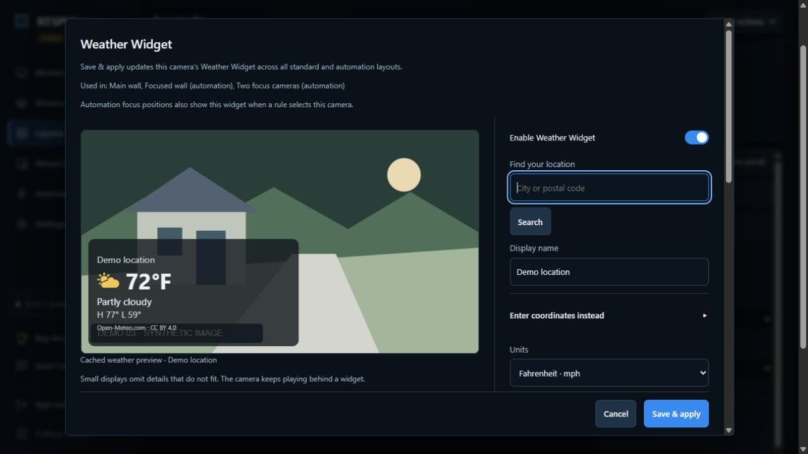

# RTSPView

RTSPView turns a Windows display into a configurable wall of live video. View camera feeds, rebroadcast streams, direct HTTP media and supported public website streams; arrange layouts, add picture-in-picture video or weather, and respond to person detections and contact sensors.

The Windows **Viewer** plays the video. The **Controller** runs web administration and supervises the Viewer. Both run as the signed-in Windows user. Browser previews are snapshots, not live video. RTSPView is for viewing, not recording or NVR playback.

**[Download the latest stable release](https://github.com/GalacticaActual75/RTSPView/releases/latest)** · [All releases](https://github.com/GalacticaActual75/RTSPView/releases) · [Feedback](https://github.com/GalacticaActual75/RTSPView/issues) · [Buy Me a Coffee](https://buymeacoffee.com/galacticaactual75)

This guide describes **[1.0.46](https://github.com/GalacticaActual75/RTSPView/releases/tag/v1.0.46)**, published September 24, 2026 UTC. See its [release notes](docs/release-1.0.46.md). Scrypted is optional: compatible sources can be used directly, without MQTT or Home Assistant.

[Install](#requirements-and-installation) · [First setup](#first-login-and-first-camera-wall) · [Streams and layouts](#streams-and-layouts) · [Automation](#automation-and-weather) · [Backups and updates](#configuration-backups-and-updates) · [Troubleshooting](#troubleshooting)

## Key features

| Area | Available functionality |
| --- | --- |
| Streams | Up to 16 main streams and 16 picture-in-picture streams; RTSP, direct HTTP/HTTPS media, and public websites resolved through bundled Streamlink/yt-dlp. ONVIF discovery and profile selection help find camera RTSP URLs. |
| Layouts | Up to 32 saved standard layouts, separate automation templates, up to 16 tiles per layout on a 12×12 grid, landscape/portrait or custom output proportions, presets, drag/resize, undo/redo, custom track sizing, framing, borders and colors. |
| Picture in picture | Independent or linked stream sources, host-tile placement, shape presets, drawn/SVG masks, opacity, zoom and pan; always-visible or automation-only display. |
| Automation | MQTT person detection, zone filters, temporary fullscreen/focus layouts, and Tapo contact-sensor actions, with shared rule priorities and recent activity. |
| Weather | Standard-layout weather tiles and camera Weather Widgets, configurable locations, units, fields and appearance. |
| Dedicated display | Monitor selection and identification, fullscreen, always-on-top, idle cursor hiding, manual focus, stream recovery and intentional Full exit. |
| Administration | Stream health, snapshots, diagnostics/logs, temperature warnings, backup/import, optional LAN access, application updates, automatic streaming-component updates and scheduled restarts. |

Capacity limits are configuration limits, not a promise that every machine can decode that many high-resolution feeds. Enabled main streams and configured picture-in-picture feeds continue decoding when hidden; resolution, frame rate, codec and source connection limits matter.

## Requirements and installation

- Windows 10/11 x64 with an interactive desktop and a current graphics driver.
- Network access from the Windows host to your sources. A modern browser is needed for web administration.
- Administrator approval for installation. Run the Viewer and Controller under the same ordinary Windows account afterward.
- The installer bundles the .NET runtime, LibVLC and integration helpers; end users do not need a separate .NET SDK, VLC, Python or Node.js installation.

The desktop application has no Docker deployment or native Android client in this repository. A phone or Android browser can administer the Windows host after LAN access is enabled; it does not replace the Windows Viewer.

1. Download the Windows installer and matching `.sha256.txt` asset from the release page. For 1.0.46 they are `RTSPView-Setup-1.0.46-win-x64.exe` and `RTSPView-Setup-1.0.46-win-x64.sha256.txt`.
2. In PowerShell, from the download directory, compute the installer hash and compare it with the checksum file:

   ```powershell
   Get-FileHash -LiteralPath .\RTSPView-Setup-1.0.46-win-x64.exe -Algorithm SHA256
   Get-Content -LiteralPath .\RTSPView-Setup-1.0.46-win-x64.sha256.txt
   ```

3. Run the installer and approve Windows elevation. The default installation directory is `%ProgramFiles%\RTSPView`; upgrades reuse the existing installation directory.
4. Leave **Start and supervise RTSPView when this user signs in** selected if this is a dedicated wall. Startup requires a Windows sign-in; installation does not configure automatic Windows login.
5. Launch RTSPView from the installer or Start menu.

### First login and first camera wall

Complete initial setup **on the Windows host** before connecting from another device.

1. Open `http://127.0.0.1:5080` or the **Web configuration** shortcut.
2. Sign in with the initial password **`admin`**. The form asks only for a password.
3. On the required password-change screen, enter `admin` as **Current password** and choose a replacement. It must be nonblank, at most 1024 characters, different from the current password and not `admin`. Use a strong password even though no minimum length is enforced.
4. Sign in again with the new password. Other administration remains blocked until setup succeeds. Existing installations use their existing password; legacy security state can require a password change.
5. Open **Streams**, edit a slot, enter a name and **Source URL**, enable it, then **Save & apply**. Fresh installations have no source URLs. Obtain a URL from your camera/server or use **Find ONVIF stream**.
6. Open **Layouts → Standard View layouts**, choose a preset, assign your stream to a tile, then **Apply to wall**. Watch the Windows Viewer to confirm playback.

The Viewer starts fullscreen and always-on-top by default. If it covers your browser, click the upper-right corner five times within three seconds and confirm the fullscreen exit. To keep other windows accessible, also clear **Keep viewer always on top** under **Settings → Display** and select **Apply changes**.

### Enable LAN administration

1. Finish setup locally, then open **Settings → Network & security → LAN access**.
2. Enable LAN access and save. Approve the Windows prompt **on the host**. Its trusted network connection must be marked **Private** in Windows.
3. Open one of the displayed `http://HOST-IP:5080` addresses from a device on the same subnet. Replace `HOST-IP` with the address shown by RTSPView; a phone's `localhost` refers to the phone.

The built-in mode uses **HTTP on TCP 5080**, with a Private/LocalSubnet firewall rule and application subnet checks. HTTP is unencrypted: use a trusted private LAN and do not expose the panel to the Internet. The switch updates the web listener without restarting video; a brief browser disconnect is normal. Disabling it restores local-only access without another elevation prompt; the firewall rule remains dormant until reused or uninstalled.

Custom `ASPNETCORE_URLS` or Kestrel endpoints disable this switch. For certificate and binding configuration, see [advanced HTTPS administration](docs/https-administration.md); HTTPS/5081 is not an installed default.

RTSP/media ports belong to the source server. MQTT uses the configured broker port (default 1883), and ONVIF discovery uses local IPv4 multicast UDP 3702. Weather, release checks and website streams need outbound Internet access. You do not need to open these as inbound administration ports.

## Web administration



All screenshots in this guide use **synthetic camera images and demo data**. Names, addresses, locations and status readings are examples; no personal streams or settings are shown. [Browse all admin previews](assets/admin-preview/README.md).

The current interface has a collapsible sidebar and six destinations:

| Destination | Main tasks |
| --- | --- |
| **Monitor** | Inspect active-wall or all-stream snapshot views, select a saved layout, refresh previews and inspect stream health. |
| **Streams** | Search, add, edit, test, restart or delete sources; discover ONVIF profiles. |
| **Layouts** | Edit standard layouts or automation templates, tile framing, canvas appearance and weather. |
| **Picture in picture** | Configure overlay sources, hosts, visibility and appearance. |
| **Automation** | Configure MQTT, Tapo and **Automation Priority**. |
| **Settings** | Display and snapshots; Network & security; Updates; Backups; Maintenance; Diagnostics; About. |

**Save scope matters:** stream and picture-in-picture **Save & apply** affect that source wherever used. Weather Widget saves affect its camera across layouts. MQTT and Tapo save their own integration settings and rules. **Save layout** saves inactive drafts without switching the wall; changes to the active standard layout require **Apply to wall**. **Save automation layouts** saves templates without selecting a standard wall. A weather tile's **Use in layout draft** does not persist the layout by itself.

In-app navigation retains unsaved drafts. Closing or reloading the browser discards them without a browser warning. Concurrent edits can be rejected as stale; reload the affected editor before retrying.

## Streams and layouts

### Source types and discovery



<details>
<summary>View the stream editor and ONVIF profile picker</summary>





</details>

| Source type | Behavior |
| --- | --- |
| **Auto** | Plays RTSP and recognized direct-media extensions directly; tries Streamlink, then yt-dlp for other HTTP(S) URLs. |
| **Direct stream** | Sends the URL to LibVLC. Use this for an extensionless direct-media endpoint. |
| **Streamlink** / **yt-dlp** | Uses only the selected website resolver. |

**Website quality limit** defaults to 720p and applies to resolved website renditions, not direct-stream transcoding. Supported media depends on LibVLC and the source. Website playback targets public, non-DRM, combined audio/video formats; login-cookie import, per-site authentication and separate-track FFmpeg muxing are not provided. Website restrictions and bot checks can prevent playback, including YouTube sources. Automatic helper updates do not guarantee site compatibility. Finite videos use the existing recovery behavior when they end.

**Test stream** checks website resolution and incoming media bytes; for direct sources it validates URL syntax only. A successful test is not proof of decoding. Use **Save & apply** and inspect the Viewer.

For ONVIF, select **Find ONVIF stream → Find cameras on host network**, or enter the camera's device-service address manually. Enter its ONVIF credentials, load profiles, choose a profile and use the selected stream, then save. Discovery runs from the Windows host and may not cross VLANs/subnets. This provides stream setup, not PTZ, ONVIF events or recording search. See the [ONVIF guide](docs/onvif.md); physical camera/firmware validation is still pending.

### Layout editing



Use presets or build a layout by moving, swapping and resizing tiles. **Canvas settings** controls output proportions, borderless mode, border/background colors and inheritance from the global border setting. Custom output dimensions range from 240 to 16384 pixels per axis; they define canvas proportions/framing, not the Windows display mode.

Select a tile for **Original**, **Fit**, **Fill** or **Stretch**, zoom and pan. Fit preserves the whole frame; Fill can crop; Stretch can distort. **Sizing → Fit tiles to streams** uses available snapshot proportions, and row/column weights allow manual refinement. Apply the layout to display it. The active standard layout cannot be deleted; templates referenced by automation rules must be unlinked first.

Configured overlay sources can also occupy ordinary tiles using their original video frame, independently of the floating overlay's mask and opacity. These original-source views share the overlay's decoded frames rather than opening another decoder just for the original-source tile. A picture-in-picture overlay linked to a main stream still has its own playback connection.

Deleting a stream clears its connection and layout placements without renumbering other streams. Remove reported automation or overlay dependencies first. Added streams reuse deleted slots.

### Picture in picture



Open **Picture in picture**, choose an overlay or add one, then select **Connection → Video source**: an existing main stream or **Own source URL**. Under **Position → Show over**, choose its host camera. Set **Always visible** or **Automation only**, adjust the preview, then **Save & apply**.

- Viewport width/height: 10–95% of the host tile; position: 0–100% of available space.
- Shape: Rectangle, Square, Rounded rectangle, Circle, Oval or Custom shape / SVG.
- Opacity: 20–100%; video zoom: 100–300%, with independent pan.
- SVG masks: path geometry with a valid viewBox, maximum 256 KB. Convert text/shapes to paths and flatten transforms before importing. The editor also supports drawing and mask rotation.

Size and position the viewport first, then frame the video inside it. Standard shapes retain their proportions; custom masks and video follow the host tile's framing and remain clipped to it. The host must be visible. Overlays hide when the Viewer is minimized or hidden. The default **Doorbell** and **Garage** names do not create sensor triggers.

### Playback tuning and resource use

Defaults are TCP, 1000 ms cache, 20-second startup timeout, 12-second stall timeout and 30-second maximum reconnect backoff. Low-latency tuning and audio decoding default off; hardware decoding is requested for main streams. Picture-in-picture composition uses software-decoded frames and can be CPU intensive.

For unstable RTSP sources, start with TCP and increase cache. **Composite stream compatibility** forces TCP, a 3000 ms cache and low latency off. Prefer lower-resolution substreams when the machine or camera cannot sustain a large wall. Disable unused main streams to stop background playback; configured automation-only overlays stay connected so they can appear promptly.

## Viewer controls and diagnostics

**Settings → Display** controls fullscreen startup, always-on-top, cursor hiding, names/borders and monitor selection. **Identify displays** shows temporary labels on the connected displays. Selection is saved by Windows display name, with the older zero-based index as fallback if the display is unavailable. Recheck placement after changing monitors.

Fullscreen and always-on-top are independent. Exiting fullscreen does not disable always-on-top. The five-click escape gesture uses the upper-right 64×64-pixel area; it is a convenience, not a secure kiosk lock.

**Full exit** in the windowed Viewer closes it and pauses automatic recovery while the Controller stays online. The pause survives Controller restarts and is respected by scheduled Viewer restarts. Use the RTSPView shortcut or **Settings → Maintenance → Start viewer** to resume. An optional top-right hover Full exit button is disabled by default. To stop both processes and the installed supervision task, run **Stop RTSPView** as administrator.

Use **Diagnostics** in the windowed Viewer to inspect feed statistics and restart a selected stream. In fullscreen, eligible stream errors open the shared diagnostics panel automatically; it closes when those issues clear. **Settings → Display → Diagnostics automatic opening** can exclude particular feeds without hiding their warnings from manual diagnostics.

Browser previews refresh while visible, approximately every 15 seconds, with captures serialized across feeds. A stale thumbnail is not the same as a failed stream. **Settings → Display → Snapshot refresh** optionally schedules captures with the browser closed (0.1–168 hours; disabled by default). The Viewer must be running.

**Settings → Maintenance** provides immediate Viewer/application controls and separate Viewer/Windows host restart schedules, both off by default. Schedules use the host's time zone; host restarts have a cancellable 60-second countdown. The Controller must remain running, and Windows sign-in/startup remains necessary after a reboot.

## Automation and weather

### MQTT person detection



In **Automation → MQTT**, configure a reachable broker, credentials and TCP/TLS transport, then add rules with exact source topics. MQTT is disabled until enabled and saved. Scrypted can supply ObjectDetector events; Home Assistant is not required.

Rules can **Show overlay**, **Fullscreen camera** or use an **Automation layout**. Choose target streams, sources, optional case-sensitive detection zones and a clear delay. Saved custom automation layouts have one or two unassigned Focus tiles filled by the rule. The default Automatic arrangement includes enabled main streams; custom templates use their saved tiles.

Discovery and connection tests do not save settings or prove that live detections work. Save, test the rule, then verify a real detection. Retained, stale and duplicate MQTT events are rejected; keep host/source clocks synchronized. Manual focus takes priority, and temporary automation restores normal presentation when it expires.

See [MQTT setup and behavior](docs/mqtt-automation.md) for discovery, timings, focus/takeover and credentials. The optional [Scrypted connector](plugins/scrypted-rtspview/README.md) can pair and sync streams/topics; it remains a beta component with live Scrypted validation pending.

### Tapo sensors and priority



**Automation → Tapo** reads T110 contact sensors through H100/H200 hubs using the bundled reader. Discover or manually add hubs, enter the Tapo account, test/discover sensors, then configure Open/Closed and Unavailable actions. It requires neither MQTT nor Scrypted. Polling defaults to five seconds; brief changes between polls can be missed. Physical hub/sensor validation remains pending and firmware compatibility varies.

Rules can show/hide an overlay or temporarily activate standard/automation layouts. **Automation Priority** orders saved MQTT and Tapo rules together; priority 1 is highest. Wall-view conflicts and conflicts for the same overlay are resolved separately. Save integration drafts before saving priority order. See the [Tapo guide](docs/tapo-automation.md) for actions and unavailable-state handling.

### Weather



In **Layouts**, use **Add weather** for a standard-layout tile, or select a main camera and choose **Weather Widget**. Choose a city or coordinates, units, fields, preset, colors, opacity and placement. Widgets save across that camera's standard and automation appearances; weather tiles remain part of the layout draft until saved/applied.

There is at most one widget per main camera and up to 32 distinct locations across saved layouts/widgets. Weather is unconfigured by default. It uses cached Open-Meteo readings without another video player. It does not provide official severe-weather alerts; small cards omit details that do not fit.

The Controller sends location searches and configured coordinates to Open-Meteo. The implementation uses its free non-commercial endpoint and has no paid-endpoint/API-key setting. Review [Open-Meteo's terms and privacy](https://open-meteo.com/en/terms) before deployment; a subscription alone does not change RTSPView's endpoint.

### Temperatures and maintenance helper

**Settings → Diagnostics** shows supported CPU/GPU temperatures and optional wall warnings. Warnings default off; initial CPU/GPU limits are 90 °C/85 °C, not manufacturer recommendations. Missing sensors remain Unavailable; RTSPView does not shut down or restart the host based on temperature.

CPU readings may require [PawnIO](https://pawnio.eu/). The **Enable maintenance helper** action installs an optional privileged service after host approval. It can install verified PawnIO and supported RTSPView updates without repeated elevation prompts; normal playback does not require it. Sensor support still depends on the hardware/driver.

## Configuration, backups and updates

### Data locations and environment

Fresh installations store `settings.json` under `%LOCALAPPDATA%\RTSPView`. The legacy settings path is `%LOCALAPPDATA%\SpotMonitor\settings.json`; if that file or a sibling `web-security.json` exists, its directory takes precedence. These paths belong to the Windows account running RTSPView.

| Variable | Behavior when set |
| --- | --- |
| `RTSPVIEW_DATA_DIR` | Overrides the data directory for both Controller and Viewer. Use the same private absolute path for both. |
| `SPOTMONITOR_DATA_DIR` | Compatibility fallback when `RTSPVIEW_DATA_DIR` is unset. |
| `RTSPVIEW_GITHUB_REPOSITORY` | Overrides the application release repository; default `GalacticaActual75/RTSPView`. It does not redirect the separately signed streaming-component feed. |
| `ASPNETCORE_URLS` | Overrides web bindings and disables the built-in LAN switch, even when set to the normal loopback URL. Default without an override is `http://127.0.0.1:5080`. |
| `AllowedHosts` | Host allowlist for custom bindings; default `localhost;127.0.0.1;[::1]`. Managed LAN mode maintains its own allowlist. |
| `ASPNETCORE_ENVIRONMENT` | ASP.NET Core environment; normal deployments use the default `Production`. |

No environment variables are required. [.env.example](.env.example) is a reference, not a file the application loads. Restart the processes after changing their environment; scheduled startup may require signing out and back in.

The data directory also contains `automation.json`, `tapo.json`, `lan-access.json`, `web-security.json`, `data-protection`, logs, thumbnails, backups and update state. Temperature preferences and restart schedules are host-local files. Some executables/task identifiers intentionally retain legacy names for upgrade compatibility.

### Back up and restore

**Settings → Backups** exports stream/display/layout/weather settings and MQTT/Tapo rules and connection settings. It removes URL user information, query strings and fragments, and omits automation passwords. It can still contain sensitive names, hosts, paths and locations. Query-dependent website URLs may need to be entered again after import.

Import validates the configuration and saves a local backup before replacement. Compatible existing automation passwords can be retained; integrations requiring missing passwords stay disabled until credentials are supplied. Older imports without automation sections preserve current automations. Native Viewer export/import includes streams, display preferences, layouts, picture-in-picture, weather and snapshot schedules, but excludes the separate MQTT/Tapo bundle. Web exports are not a complete host backup: they omit security keys, LAN state, temperature preferences and restart schedules.

For a private full backup, stop the Controller and Viewer and copy the entire data directory. Stream credentials are plaintext in local settings; protect all copies. Windows-protected automation credentials and keys are tied to the owning identity, so moving files is not a portable credential migration.

### Update RTSPView

Use **Settings → Updates** to choose Stable/Beta, check and confirm installation. Changing channel does not install anything; Beta hosts stay on Beta until switched. Stable uses GitHub's latest stable release; Beta selects versioned beta releases and excludes drafts and streaming-component releases. Application checks run approximately daily, but application installation requires confirmation.

Installers are downloaded over HTTPS and verified against release checksums. Installation requires host approval unless the optional maintenance helper and target installer support service updates. Manual installation over the existing version also preserves settings. Back up before upgrading or downgrading; restore a compatible pre-upgrade backup when rolling back. The first weather-schema migration preserves `settings.json.before-weather.json` when applicable.

**Automatic streaming components** is separate: signed Streamlink/yt-dlp packages are checked and installed in the background daily without an installer, elevation or Viewer restart. Existing streams keep their relays; new/retrying website streams use the updated helper. Packages live under the data directory's `Streaming` folder, with fallback to a previous/bundled helper after startup health-check failure. See [streaming-component updates](docs/streaming-updates.md).

## Troubleshooting

| Problem | What to check |
| --- | --- |
| Cannot open administration | Start Controller and try `http://127.0.0.1:5080` on the host. Check port conflicts and custom bindings. For LAN access, check the Private network profile, subnet and guest Wi-Fi isolation. |
| Blank or missing stream | Check the URL, credentials, enabled state and active-layout assignment. Confirm source reachability from Windows. Direct-source Test stream does not check playback. |
| ONVIF finds nothing | Enable ONVIF on the camera, check its account, or enter its device-service address manually; multicast often stays within one subnet. |
| Website fails to play | Inspect source status, try the appropriate source type/quality and check streaming-component status. Site authentication, DRM and bot restrictions may be unsupported. |
| High CPU or stalls | Use substreams, disable unused main streams and reduce picture-in-picture load. Check source connection limits; try more cache for unstable RTSP feeds. |
| Automation connected but no action | Check saved/enabled rules, exact topics/zones, real event timestamps, target URL, host-tile visibility, Viewer connection and competing priorities/manual focus. Test the rule separately from the real event. |
| Viewer stays closed or returns after closing | Use Start viewer after intentional Full exit. Otherwise supervision may restart a closed Viewer; Stop RTSPView stops the installed processes/task. |
| Old thumbnail | Refresh the snapshot and inspect its timestamp separately from live stream status. Captures need a running Viewer. |
| Updates unavailable | Check Internet access, GitHub rate limits and release assets/checksums. Use the matching manual installer if necessary. |
| Storage or settings errors | Preserve the data directory, check free space/permissions and inspect the primary/backup state. Logs can drop entries during storage failures and are not a guaranteed audit trail. |

**Forgotten administrator password:** stop both processes and privately back up the data directory. As the owning Windows user, move **only `web-security.json`** out of the active directory, then restart and complete local setup with `admin`. Keep `data-protection` intact: deleting it can make saved MQTT/Tapo passwords unreadable. Existing camera settings remain; pair the Scrypted connector again. Login throttling allows five attempts per five-minute window; wait for the window to expire if necessary.

## Security and privacy

- Keep administration local or on a trusted private LAN; configure HTTPS when encryption is needed. Do not port-forward the panel.
- Use a dedicated Windows account and restrict its data directory and backups. Administrator passwords are hashed; camera URLs remain readable locally. Windows data protection protects integration passwords and cookie keys, not all configuration.
- Review screenshots, logs, MQTT payloads and exports before sharing. Camera images, coordinates, hostnames, paths and names can be sensitive even after passwords are removed. Rebroadcast URL paths can themselves grant access.
- Updates trust the project's release publisher; matching checksums alone do not establish an independent publisher identity. Streaming components additionally use an embedded signing key.
- Weather and website playback contact external services. The Scrypted connector exchanges credentials/configuration; use a trusted network or configured HTTPS for pairing and sync.

See [privacy guidance](docs/privacy.md). Do not attach raw configuration exports to public issues.

## Development and contributing

Build from the tag corresponding to the version you intend to run. Release tags and the default branch can differ. Use Windows x64, the .NET 8 SDK selected by [global.json](global.json), Node.js 22 and PowerShell 7 for the check runner. Native rendering checks need an interactive Windows desktop.

```powershell
git clone https://github.com/GalacticaActual75/RTSPView.git
Set-Location RTSPView
git switch --detach v1.0.46
dotnet restore RTSPView.sln -r win-x64
dotnet build RTSPView.sln -c Release --no-restore
dotnet run --project tests/RTSPView.ConfigurationChecks -c Release
node tests/modern-admin.checks.cjs
```

Run `pwsh -File tools/checks.ps1` for the repository's broader checks. These include console executables, Node and PowerShell scripts; `dotnet test` alone does not execute them all. Tests use isolated fixtures where provided; physical-device validation is separate.

Complete packages also require Python 3.12 to build the bundled [Tapo reader](integrations/tapo-reader/README.md) and [website resolver](integrations/stream-resolver/README.md), plus Inno Setup 6 for the installer. A plain solution build does not create those frozen helpers. Follow the [release workflow](.github/workflows/release.yml) for packaging and synthetic playback checks. The helpers' early beta notes about installer-only updates are superseded by [automatic component updates](docs/streaming-updates.md).

For maintainers, `tools/publish-release.ps1 -Version <version>` creates and pushes a release tag from a clean checkout, triggering publication. Use it only when intending to publish a reviewed release.

For contributions, open an issue describing the problem or proposal, keep changes focused and include relevant checks and documentation. Use synthetic sources in tests and screenshots. Review [licensing status](docs/licensing.md) before reusing or redistributing project code.

## Support and license

[Report a bug or suggest an improvement](https://github.com/GalacticaActual75/RTSPView/issues/new/choose), or [browse existing issues](https://github.com/GalacticaActual75/RTSPView/issues). Include the version, expected/actual behavior and reproduction steps, with sensitive details removed. The web sidebar also has **Send Feedback** and **Buy Me a Coffee**.

If you would like to support development, [Buy Me a Coffee](https://buymeacoffee.com/galacticaactual75).

RTSPView's project-owned source currently has **no open-source license grant**. The public repository and third-party licenses do not provide a project-wide license. See [licensing status and third-party notices](docs/licensing.md); the Tapo reader and other bundled dependencies retain their own licenses.
